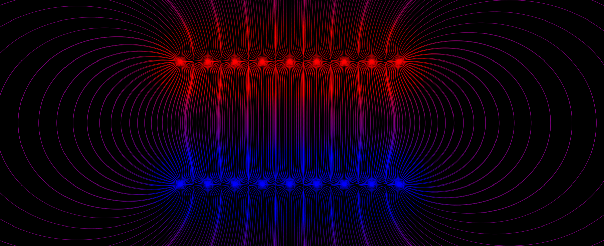

# Physics Simulation Engine (pSEngine)
## Presentation
Physics Simulation Engine (or pSEngine) is a JavaScript library that allows you to build simulations and animate them. You can use it freely by building science popularization content, by creating WEB animations, or just by simulating physicals and mathematical phenomena's by your own.

The main goal of this library is for you to only focus on building the simulation or the animation, without worrying on the technical program requirements (like handling an update loop, directly drawing shapes in color, or writing LaTeX code directly into the canvas, ...). pSEngine uses `canvas` HTML components, using the [p5.js](https://p5js.org/) library for drawing shapes and handling colors, and the [MathJax 3.0](https://www.mathjax.org/) library to handle LaTeX code.

pSEngine is a free and open-source project, so you can directly support it by submitting improvements and by creating new pull requests or issues. We'll be happy to answer your questions and to add your new code implementation ideas.

## Get Started
To get started using pSEngine, you should check the [Physics Simulation Engine wiki](https://github.com/mecanicascience/PhysicsSimulationEngine/wiki), which also contains detailed information about mainly everything possible with this JavaScript library.

If you want to know how simulations (and so, how this engine) works, you can also [read an article](https://mecanicascience.herokuapp.com/article/les_bases_de_la_simulation&articleview&3) published on the website of Mecanica Science called 'Simulation bases'. (Warning : Article is written in French).

You can also check [pSEngine examples](https://github.com/mecanicascience/PhysicsSimulationEngine/tree/master/examples) to see how a simple program works. Also, you can see full [simulation examples](https://github.com/mecanicascience/PhysicsSimulationEngine#simulations-and-animations-examples) to enhance your understanding about the library.

## Issues
If you encountered any issue, you can describe it under the [issues panel](https://github.com/mecanicascience/PhysicsSimulationEngine/issues). You can also request new features here.

Please be polite, correct and precisly describe what your problem or suggestion is. Please also note that pSEngine is only maintained by volunteers, so please be tolerant about the possible answer delay.

## How to contribute
[TODO]

## Credits
Here are pSEngine was created and is currently maintained by [Mecanica Science](https://mecanicascience.herokuapp.com/).
You can find further information and library credits down below.
 - If you want to use pSEngine, you need to follow the [license requirements](https://github.com/mecanicascience/PhysicsSimulationEngine/blob/master/LICENSE) (to sum-up, you can use pSEngine everywhere and for any purposes, as long as you notice copyright).
 - You can find all pSEngine versions on [this link](https://github.com/mecanicascience/PhysicsSimulationEngine/releases).
 - You can check the [wiki](https://github.com/mecanicascience/PhysicsSimulationEngine/wiki) to learn how to use the library, or to find any technical information you might need.
 - pSEngine uses [p5.js](https://p5js.org/) and [MathJax 3.0](https://www.mathjax.org/).

# Simulations and animations examples
An example of an Electric field. [See live demo](https://mecanicascience.herokuapp.com/simulationview/champ_electrique&simulationview&electromag&2).

You can also draw and animate TeX code.

A simulation of the Solar System with real distances. [See live demo](https://mecanicascience.herokuapp.com/simulationview/simulation_systeme_solaire&simulationview&mecanique&1).

